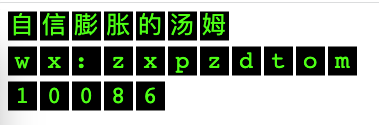

## Cloudflare Referer Counter SVG

利用 Cloudflare Workers 实现的引用来源计数器，同时生成相应的 SVG 图像的项目。

### 注意事项
worker中的 REFERER_COUNTER 变量记得和 KV 命名空间绑定

### 打赏支持&问题私信
| **微信打赏** | **支付宝打赏** | **加好友（微信）** |
| --- | --- | --- |
|  |  |  |

**感谢您的支持，打赏将激励我产出更优质的内容。如有任何问题，请私信联系我。**

### 访问量

